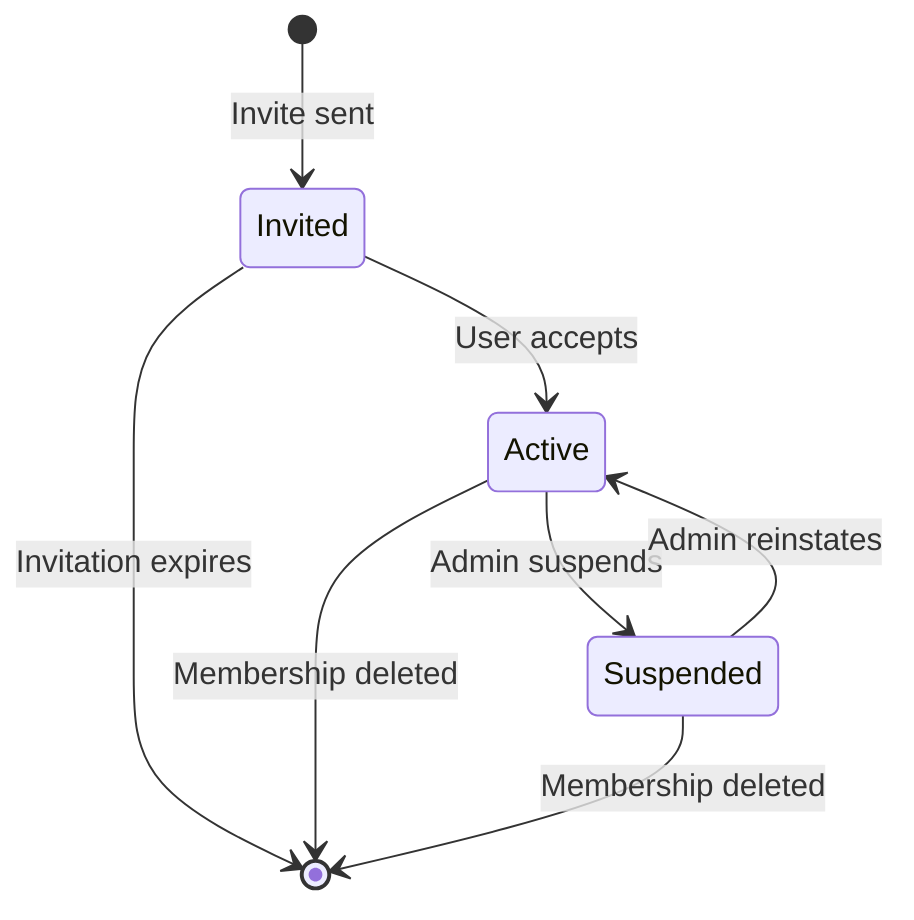

# Memberships

Memberships are the authority records that link an [Account](identity-model.md) to a [Profile](identity-model.md) inside a workspace. A membership references the profile (via `profile_id`), the workspace, and optionally a project, and it carries the role assignments, the membership `status`, and the `scope`. A membership may also carry directly attached policies (`policy_ids`).

The mental model is:

**Account (system identity) → Profile (workspace identity) → Membership (authority)**

An account's permissions in a workspace or project are determined by their memberships.

## Membership Structure

A membership defines:

- **Who**: The workspace identity — the linked [profile](identity-model.md), referenced via `profile_id`
- **Where**: The workspace, and optionally a project
- **What roles**: The assigned roles (and thus permissions)
- **What policies**: Optionally, directly attached `policy_ids`
- **Status**: Whether the membership is active

```
Membership
├── account_id    → System identity (opaque outside the system)
├── profile_id    → Workspace identity (nullable for legacy memberships)
├── workspace_id  → Which tenant
├── scope         → workspace or project
├── project_id    → Which project (if project-scoped)
├── status        → invited | active | suspended
├── role_ids      → Which roles (permission bundles)
└── policy_ids    → Directly attached policies (optional)
```

### Membership Fields

| Field | Type | Description |
|-------|------|-------------|
| `id` | UUID | Membership identifier |
| `account_id` | UUID | System identity the membership belongs to (opaque outside the system) |
| `profile_id` | UUID? | Workspace identity the membership references; nullable for legacy memberships created via the `account_id` path |
| `workspace_id` | UUID | The workspace |
| `project_id` | UUID? | The project (if project-scoped) |
| `scope` | string | `"workspace"` or `"project"` |
| `status` | string | `"invited"`, `"active"`, or `"suspended"` |
| `role_ids` | UUID[] | Assigned roles (permission bundles) |
| `policy_ids` | UUID[] | Directly attached policies (optional) |

## Scope Types

### Workspace Scope

A member with a workspace-scoped membership has access to the entire workspace:

```json
{
  "profile_id": "profile-id",
  "scope": "workspace",
  "project_id": null,
  "role_ids": ["viewer-role-id"]
}
```

This grants the `viewer` role's permissions across all projects in the workspace.

### Project Scope

A member with a project-scoped membership has access limited to a specific project:

```json
{
  "profile_id": "profile-id",
  "scope": "project",
  "project_id": "web-app-project-id",
  "role_ids": ["developer-role-id"]
}
```

This grants the `developer` role's permissions **only** within the `web-app` project.

!!! tip "Combining Scopes"
    A member can have both workspace-scoped and project-scoped memberships simultaneously. The effective permissions are the **union** of all roles from all memberships.

## Onboarding by Email

Members are onboarded by email on membership create:

1. **Resolve or create the account** — the supplied `email` is validated/normalized and resolved to an existing [account](identity-model.md), or a new account is created.
2. **Ensure the profile** — a [profile](identity-model.md) is created (or resolved) for that account in the workspace. There is exactly one profile per account per workspace.
3. **Create the membership** — the membership is created referencing the profile (`profile_id`), with its roles, status, scope, and optional directly attached `policy_ids`.

When `account_id` is provided, the account is resolved by id and the supplied email becomes the profile email; when omitted, the email is resolved or a new account is created. `membership.profile_id` is nullable only for legacy memberships created through the `account_id` path before a profile was resolved.

## Membership Lifecycle



### Status Transitions

| From | To | Who | Meaning |
|------|----|-----|---------|
| `invited` | `active` | User | User accepted the invitation |
| `active` | `suspended` | Admin | Temporarily disable access |
| `suspended` | `active` | Admin | Restore access |
| Any | `[deleted]` | Admin | Permanently remove |

## Unique Constraints

The database enforces these membership uniqueness rules:

- **One workspace membership per account**: An account can only have one `scope: workspace` membership per workspace
- **One project membership per account per project**: An account can only have one `scope: project` membership per project
- **Workspace + project memberships can coexist**: An account can be both a workspace member and a project member

## Effective Permissions

An account's effective permissions in a context are the union of all role permissions from all active memberships. Effective **policies** are the deduplicated union of the policies attached to those roles and memberships (`policy_ids`), evaluated with [deny overrides allow, default deny](../architecture/policies.md).

```
Account: alice
├── Membership 1 (scope: workspace, status: active, profile: alice-profile)
│   └── Role: Viewer
│       ├── account:readSelf
│       └── workspace:read
└── Membership 2 (scope: project, project: web-app, status: active, profile: alice-profile)
    └── Role: Developer
        ├── project:read
        └── project:update

Effective permissions for alice:
├── account:readSelf     (from Viewer)
├── workspace:read       (from Viewer)
├── project:read         (from Developer)
└── project:update       (from Developer)
```

!!! note "Suspended Memberships"
    Memberships with `status: suspended` do **not** contribute to effective permissions.

## Managing Memberships via the API

### Adding a New Member

1. Provide the member's `email` — the API resolves it to an existing [account](identity-model.md) or creates a new one
2. The API creates (or resolves) the workspace [profile](identity-model.md) for that account
3. Create the [membership](../api/memberships.md#create-membership) with the email, roles, scope, status, and optional `policy_ids`; it references the profile via `profile_id`

### Changing a Member's Roles

Update the roles on the membership:

```json
{
  "workspace_id": "...",
  "id": "membership-id",
  "role_ids": ["new-role-id-1", "new-role-id-2"]
}
```

This **replaces** all existing roles on the membership. Passing `policy_ids` likewise **replaces** all directly attached policies.

### Temporarily Suspending Access

```json
{
  "workspace_id": "...",
  "id": "membership-id",
  "status": "suspended"
}
```

### Permanently Removing Access

Delete the membership entirely:

```json
{
  "workspace_id": "...",
  "id": "membership-id"
}
```

## Audit Trail

Membership changes are tracked through audit fields:
- `created_at` / `created_by` — When and by whom the membership was created
- `updated_at` / `updated_by` — When and by whom it was last modified
- `audit` — JSONB field for structured audit data
