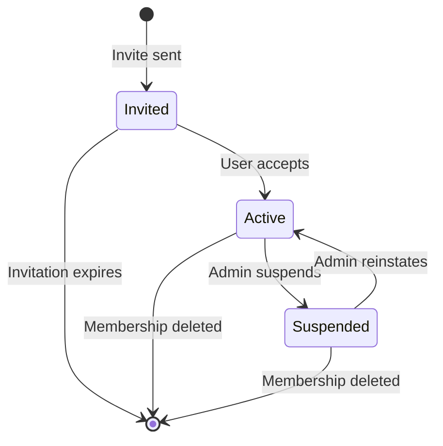

# Memberships

Memberships are the bridge between accounts and the resources they can access. Every account's permissions in a workspace or project are determined by their memberships.

## Membership Structure

A membership defines:

- **Who**: The account
- **Where**: The workspace or project
- **What roles**: The assigned roles (and thus permissions)
- **Status**: Whether the membership is active

```
Membership
├── account_id    → Which user
├── workspace_id  → Which tenant
├── scope         → workspace or project
├── project_id    → Which project (if project-scoped)
├── status        → invited | active | suspended
└── role_ids      → Which roles (permission bundles)
```

## Scope Types

### Workspace Scope

An account with a workspace-scoped membership has access to the entire workspace:

```json
{
  "scope": "workspace",
  "project_id": null,
  "role_ids": ["viewer-role-id"]
}
```

This grants the `viewer` role's permissions across all projects in the workspace.

### Project Scope

An account with a project-scoped membership has access limited to a specific project:

```json
{
  "scope": "project",
  "project_id": "web-app-project-id",
  "role_ids": ["developer-role-id"]
}
```

This grants the `developer` role's permissions **only** within the `web-app` project.

!!! tip "Combining Scopes"
    An account can have both workspace-scoped and project-scoped memberships simultaneously. The effective permissions are the **union** of all roles from all memberships.

## Membership Lifecycle



### Status Transitions

| From | To | Who | Meaning |
|------|----|-----|---------|
| `invited` | `active` | User | User accepted the invitation |
| `active` | `suspended` | Admin | Temporarily disable access |
| `suspended` | `active` | Admin | Restore access |
| Any | `[deleted]` | Admin | Permanently remove |

## Unique Constraints

The database enforces these membership uniqueness rules:

- **One workspace membership per account**: An account can only have one `scope: workspace` membership per workspace
- **One project membership per account per project**: An account can only have one `scope: project` membership per project
- **Workspace + project memberships can coexist**: An account can be both a workspace member and a project member

## Effective Permissions

An account's effective permissions in a context are the union of all role permissions from all active memberships:

```
Account: alice
├── Membership 1 (scope: workspace, status: active)
│   └── Role: Viewer
│       ├── account:readSelf
│       └── workspace:read
└── Membership 2 (scope: project, project: web-app, status: active)
    └── Role: Developer
        ├── project:read
        └── project:update

Effective permissions for alice:
├── account:readSelf     (from Viewer)
├── workspace:read       (from Viewer)
├── project:read         (from Developer)
└── project:update       (from Developer)
```

!!! note "Suspended Memberships"
    Memberships with `status: suspended` do **not** contribute to effective permissions.

## Managing Memberships via the API

### Adding a New Member

1. Create the [account](../api/accounts.md#create-account) (if it doesn't exist)
2. Create the [membership](../api/memberships.md#create-membership) with appropriate roles

### Changing a Member's Roles

Update the roles on the membership:

```json
{
  "workspace_id": "...",
  "id": "membership-id",
  "permission_ids": ["new-role-id-1", "new-role-id-2"]
}
```

This **replaces** all existing roles on the membership.

### Temporarily Suspending Access

```json
{
  "workspace_id": "...",
  "id": "membership-id",
  "status": "suspended"
}
```

### Permanently Removing Access

Delete the membership entirely:

```json
{
  "workspace_id": "...",
  "id": "membership-id"
}
```

## Audit Trail

Membership changes are tracked through audit fields:
- `created_at` / `created_by` — When and by whom the membership was created
- `updated_at` / `updated_by` — When and by whom it was last modified
- `audit` — JSONB field for structured audit data
