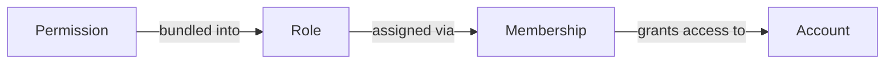

# RBAC & Permissions

OxideAuth implements **Role-Based Access Control (RBAC)** with fine-grained permissions.

## Permission Model

The system has four layers of access control:



### 1. Permissions

Permissions are the atomic units of access control. Each permission grants the ability to perform one action on one resource type.

**Format:** `resource:action`

```
account:readAny     — Read any account
account:create      — Create new accounts
workspace:delete    — Delete a workspace
project:update      — Update a project
```

### 2. Roles

Roles bundle multiple permissions into a named group. Roles are assigned to accounts through memberships.

```
Role: "Admin"
├── account:*
├── workspace:*
├── project:*
├── role:*
└── permission:manageConfig

Role: "Viewer"
├── account:readSelf
├── workspace:read
└── project:read
```

### 3. Memberships

Memberships link accounts to workspaces (or projects) with assigned roles. An account can have multiple memberships, each with different roles.

### 4. Account Context

When an authenticated request arrives, the `CtxMiddleware` resolves:

1. The account ID from the JWT
2. The workspace context
3. The account's memberships in that workspace
4. The roles from those memberships
5. The permissions from those roles

This produces a `CoreCtx` that the service layer uses for authorization.

## Wildcard Support

Permissions support three wildcard patterns:

| Pattern      | Example     | Description                        |
| ------------ | ----------- | ---------------------------------- |
| `*`          | `*`         | All permissions on all resources   |
| `resource:*` | `account:*` | All actions on a specific resource |
| `*:action`   | `*:read`    | A specific action on all resources |

### Permission Matching

The `PermissionEngine` resolves wildcards hierarchically:

```
Permission required: account:readAny

User's permissions:
  account:readAny     ✅ Exact match
  account:*           ✅ Wildcard action
  *:read              ❌ No — action is "read" but requires "readAny"
  *                   ✅ Global wildcard
```

```
Permission required: project:create

User's permissions:
  project:read        ❌ Wrong action
  project:*           ✅ Wildcard matches
  *:create            ✅ Action wildcard matches
```

## Permission Hierarchy

```
*                        (Super admin — everything)
├── account:*
│   ├── account:readSelf
│   ├── account:readAny
│   ├── account:create
│   ├── account:updateSelf
│   ├── account:updateAny
│   ├── account:deleteSelf
│   └── account:deleteAny
├── workspace:*
│   ├── workspace:list
│   ├── workspace:create
│   ├── workspace:read
│   ├── workspace:update
│   └── workspace:delete
├── project:*
│   ├── project:list
│   ├── project:create
│   ├── project:read
│   ├── project:update
│   └── project:delete
├── membership:*
│   ├── membership:list
│   ├── membership:invite
│   ├── membership:updateStatus
│   ├── membership:manageRole
│   ├── membership:delete
│   └── membership:readSelf
├── role:*
│   ├── role:list
│   ├── role:create
│   ├── role:update
│   └── role:delete
├── permission:*
│   ├── permission:read
│   └── permission:manageConfig
├── credential:*
│   ├── credential:manageSelf
│   └── credential:resetAny
└── token:*
    └── token:revokeSelf
```

## Best Practices

### Principle of Least Privilege

Start with minimal permissions and add as needed:

1. Create specific permissions for each action (`account:readSelf`, `account:readAny`)
2. Create narrow roles (`viewer`, `editor`, `admin`)
3. Assign the least powerful role that satisfies the use case
4. Use project-scoped memberships to further restrict access

### Naming Conventions

- **Self vs Any**: Use `Self` suffix for own-resource operations (`updateSelf`, `deleteSelf`), `Any` for cross-account operations (`readAny`, `updateAny`)
- **CamelCase actions**: `readSelf`, `updateAny`, `manageRole`, `manageConfig`, `updateStatus`
- **Singular resources**: `account`, `workspace`, `project`, `role`, `permission`, `membership`, `credential`, `token`

### Testing Permissions

Use the Postman collection to verify:

1. Create a permission → Create a role with that permission → Create a membership with that role
2. Make API calls and verify `403` responses for missing permissions
3. Use the `*` wildcard temporarily to isolate whether an issue is permission-related or logic-related
