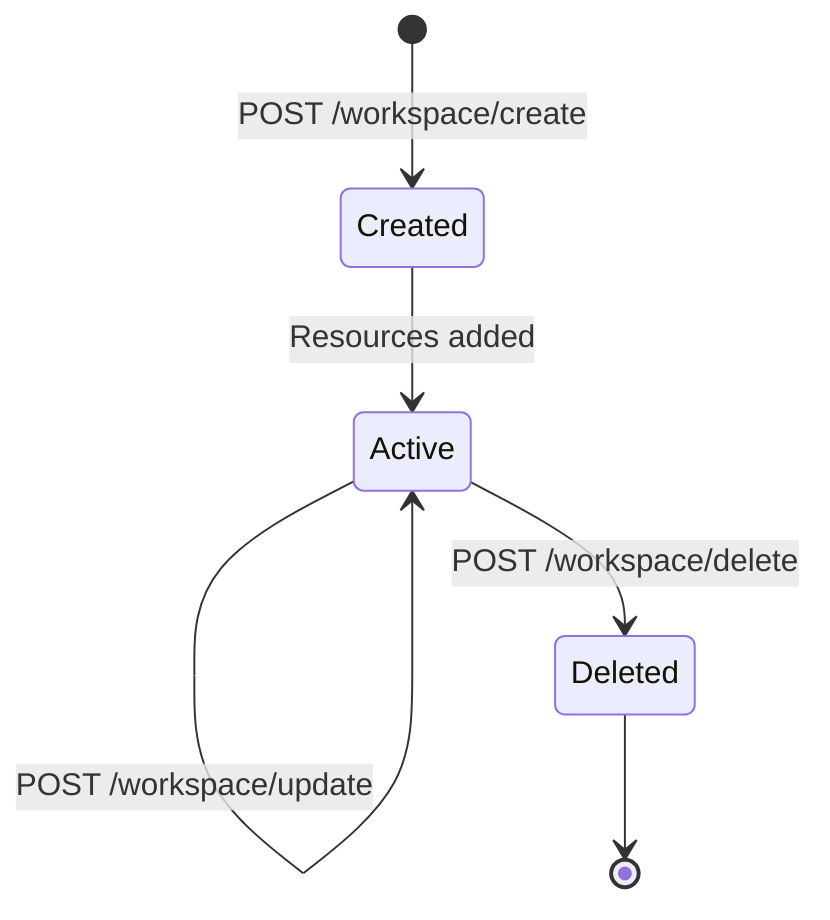

# Multi-Tenancy & Workspaces

OxideAuth is a **multi-tenant** IAM platform. The `Workspace` is the primary isolation boundary.

## What is a Workspace?

A workspace is a self-contained tenant that owns all its resources:

- Accounts (via memberships)
- Projects
- Roles
- Permissions
- Credentials
- Token session data

## Tenant Isolation

Workspace isolation is enforced at every layer:

### 1. Data Layer
All resource tables include a `workspace_id` column. Queries are always scoped by workspace.

### 2. Service Layer
The `AuthValidator` checks that:
- The caller has `workspace:describe` permission on the target workspace
- The requested resource belongs to that workspace
- Cross-workspace access is rejected with `403 Forbidden`

### 3. JWT Claims
The authenticated context (`CoreCtx`) includes the current workspace ID. The middleware extracts this from the JWT token, and services use it to scope all operations.

## Workspace Lifecycle



### Creating a Workspace

When you create a workspace, it starts empty. You then populate it with:

1. **Permissions** — Define what actions are possible
2. **Roles** — Bundle permissions into assignable groups
3. **Accounts** — Create user identities
4. **Memberships** — Link accounts to the workspace with roles
5. **Projects** — Optionally create sub-scopes within the workspace

### Deleting a Workspace

!!! danger "Destructive Operation"
    Deleting a workspace removes the workspace and all associated resources. This operation cannot be undone.

## Workspace vs Project

| Aspect | Workspace | Project |
|--------|-----------|---------|
| Scope | Top-level tenant | Sub-scope within a workspace |
| Uniqueness | Globally unique name/slug | Name unique within workspace |
| Memberships | Direct via workspace scope | Via project scope membership |
| Use Case | Organization, company, team | Application, microservice, sub-team |

### When to Use a Project

Use projects when you need finer-grained access control within a workspace. For example:

- **Multiple applications**: Each app gets its own project for per-app role assignments
- **Team boundaries**: Different teams working in the same workspace with different access levels
- **Environment separation**: `project:staging` vs `project:production` with different permissions

### Example Hierarchy

```
Workspace: "Acme Corp"
├── Project: "web-app"       (frontend team access)
├── Project: "api"           (backend team access)
├── Project: "mobile"        (mobile team access)
└── Account: "alice"         (member of workspace + web-app project)
    ├── Membership (scope: workspace, role: "viewer")
    └── Membership (scope: project, project: "web-app", role: "developer")
```

## Workspace Slug

The `slug` is a URL-friendly unique identifier used as an alternative to UUIDs. It must be:

- Globally unique across all workspaces
- Lowercase alphanumeric with hyphens
- Immutable once set (use `update` to change it)

Good examples: `my-org`, `acme-corp`, `engineering-team`
