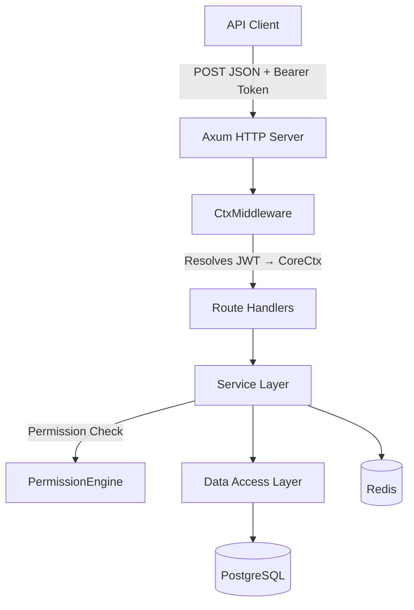
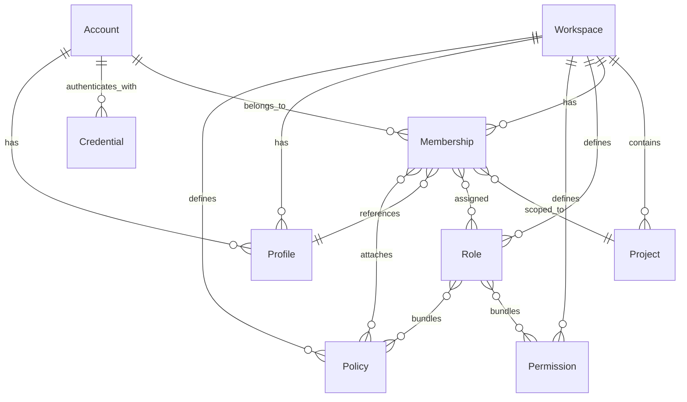

# OxideAuth API

**Identity & Access Management Platform**

OxideAuth is a multi-tenant IAM (Identity & Access Management) REST API built in Rust. It provides authentication, role-based access control (RBAC), workspace management, and credential lifecycle management.

## Key Features

- **Multi-Tenancy** — Workspaces isolate users, projects, and permissions
- **RBAC** — Fine-grained role and permission system with wildcard support (`account:*`, `*:read`)
- **JWT Authentication** — HS256-signed tokens with revocation and refresh support
- **OAuth2 / OIDC** — Google OAuth integration for social login
- **Credential Management** — Password, OAuth, SSO, and API key credential types
- **Token Revocation** — Version-based invalidation via membership/account/session version claims
- **Email** — AWS SES integration with Tera HTML templates

## Architecture Overview

## API at a Glance

| Resource                          | Endpoints | Description                                         |
| --------------------------------- | --------- | --------------------------------------------------- |
| [Health](api/health.md) | 2 | Server liveness & root endpoint |
| [Auth](api/auth.md) | 10 | Authentication, OAuth2, token & password management |
| [Workspaces](api/workspace.md) | 5 | Multi-tenant containers |
| [Accounts](api/accounts.md) | 5 | User identity management |
| [Projects](api/projects.md) | 5 | Scoped work areas within workspaces |
| [Profiles](api/profiles.md) | 4 | Workspace-scoped identities |
| [Clients](api/clients.md) | 7 | Service clients & token validation |
| [Roles](api/roles.md) | 5 | Permission & policy bundles |
| [Permissions](api/permissions.md) | 5 | Fine-grained access control |
| [Policies](api/policies.md) | 5 | Allow/deny authorization rules |
| [Memberships](api/memberships.md) | 5 | Account-to-workspace/project links |
| [Credentials](api/credentials.md) | 4 | Auth credential lifecycle |

**62 total endpoints** — all JSON POST (except 2 GET health endpoints and 1 GET OAuth callback) with a standard `{ success, status, data }` envelope.

## Data Model

## Quick Links

- [Getting Started](getting-started.md) — Setup and first API call
- [Authentication](authentication.md) — Tokens, permissions, and security
- [Response Envelope](response-envelope.md) — Standard response format
- [Concepts](concepts/workspaces.md) — Deep dive into architecture concepts
- [Postman Collection](https://github.com/subaquatic-pierre/oxideauth/blob/main/references/OxideAuth.postman_collection.json) — Import-ready test collection
